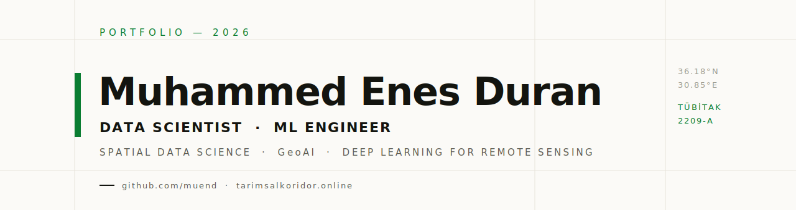
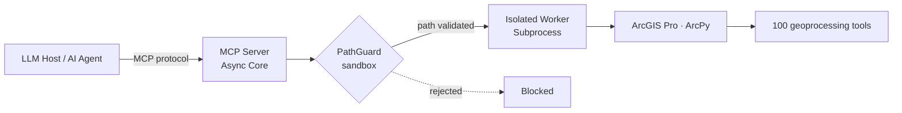

  

  
  

I build production-grade GeoAI: spatial decision-support systems, ArcGIS automation exposed to LLM agents, and deep-learning pipelines for satellite imagery — connecting rigorous mathematical models to systems people can actually use.

  
  
  
  

---

## Technical Core & Methodology

I focus on structural data science and deep learning architectures, building robust end-to-end machine learning pipelines (*O(N)* efficiency), data ingestion engines, and secure automation interfaces that connect mathematical models with complex enterprise systems.

**Core AI/ML**
 

**Spatial Data Science**
 

-2C7FB8?style=flat-square&logo=arcgis&logoColor=white)

**MLOps & Infrastructure**
 

---

## Flagship Systems & ML Infrastructure

### 1. [arcgis-mcp-bridge](https://github.com/muend/arcgis-mcp-bridge)

An institutional-grade Model Context Protocol (MCP) framework exposing exactly **100 specialized geoprocessing tools** directly to LLM hosts and intelligent agents — turning ArcGIS Pro into a programmable backend for AI workflows.

- **Process Isolation:** Built with a strict decoupled multi-process architecture (Async Core / Isolated Worker Subprocess) to guarantee runtime protection against environment blockages.
- **Security Layer:** Features a strict PathGuard sandbox enforcing prefix validation over database structures before any algorithmic execution occurs.

### 2. [agri-dss](https://github.com/muend/agri-dss) &nbsp;—&nbsp; Live at [tarimsalkoridor.online](https://tarimsalkoridor.online)

A fully client-side Spatial Decision Support System (Agri-DSS) for the Western Antalya agricultural corridor — **5 districts, 147 neighborhoods** (Demre, Finike, Kaş, Kemer, Kumluca) — turning local agronomic and economic knowledge into a concrete, printable plan for each neighborhood: seasonal crops rated by yield and profitability, a long-term orchard investment, and an emerging market opportunity.

- **Zero-Backend Static Architecture:** A single vanilla-JS `index.html` carrying all DSS logic against a decoupled `data.json` layer — no backend, no build step. Trivially hostable on GitHub Pages, instantly auditable, and immune to server outages.
- **DRY Data Contract:** A compact `cropSets` / `longTermCrops` / `regions` structure resolved at runtime — recommendations can be updated by editing `data.json` alone, with no code changes.
- **Swiss / Typographic Interface:** International Typographic Style UI (Archivo + Space Mono, modular grid, single agricultural-green accent) with a guided stepper, corridor diagram, and live counters — collapsing to a clean ink-on-white **A4 print layout** for village boards and cooperatives.

  

---

## Academic & Research Projects

Reproducible, peer-review–oriented studies in spatial econometrics, urban resilience, and deep learning for remote sensing.

### [agri-unet](https://github.com/muend/agri-unet) &nbsp;·&nbsp; `Deep Learning / CV` &nbsp;·&nbsp; 

The codebase for my **TÜBİTAK 2209-A** research project (*University Students Research Projects Support Program*) — an accepted, grant-funded study. A **U-Net** semantic segmentation pipeline for agricultural pattern identification from high-resolution, multi-temporal satellite imagery, extracting field parcels and crop structures for downstream suitability modeling.

### [turkiye-housing-prices-pandemic](https://github.com/muend/turkiye-housing-prices-pandemic) &nbsp;·&nbsp; `Spatial Econometrics`

Region-level analysis of Türkiye's housing market that separates real (inflation-adjusted) price growth from inflation, comparing the six years before and after the COVID-19 pandemic (2014–2025).

- Reproducible Python notebook with high-resolution choropleth figures and a House Price Index (HPI) deflation pipeline.
- **LISA** (Local Indicators of Spatial Association) analysis to detect statistically significant regional clusters and spatial outliers.

### [kutri-resilience-index](https://github.com/muend/kutri-resilience-index) &nbsp;·&nbsp; `Composite Indicators`

A reproducible urban-territorial resilience index prototype for Kaş / Bayındır, Antalya, based on a five-pillar composite indicator framework.

- Transparent indicator normalization and weighting methodology with fully reproducible notebooks and figures.
- Bridges quantitative spatial analysis with applied territorial planning.

---

## Featured Repositories

  
  

---

## Active Research & Deep Learning Workspace

- **Computer Vision for Remote Sensing:** Formulating automated pipelines for agricultural pattern identification and urban object extraction from high-resolution multi-temporal satellite imagery using Convolutional Neural Networks (CNN) and U-Net segmentation models.
- **Urban Resilience Forecasting:** Engineering predictive spatial suitability matrices and long-term geometric resilience frameworks for horizon target lines using robust statistical models.

---

## Focus

Open to collaborative tracks involving production-grade Data Science, Spatial Machine Learning pipelines, and automated GeoAI systems architecture.

- **Live App:** [tarimsalkoridor.online](https://tarimsalkoridor.online)
- **Email:** [edcoders@gmail.com](mailto:edcoders@gmail.com)
