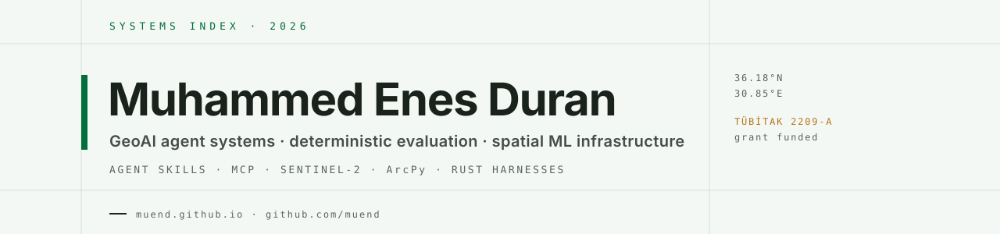
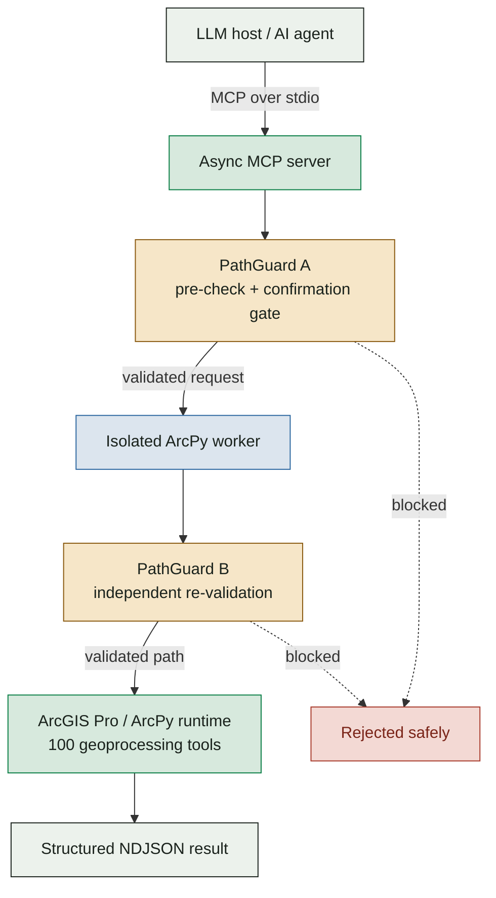

  <picture>
    <source media="(prefers-color-scheme: dark)" srcset="./assets/banner-dark.svg">
    
  </picture>

  
  
  
  
  

I build **GeoAI agent systems, spatial ML infrastructure, and deterministic evaluation harnesses**: standards-driven Agent Skills for geospatial reasoning, MCP tooling that automates ArcGIS Pro without handing an LLM the runtime, reproducible Sentinel-2 pipelines, and decision systems people actually open.

The through-line is evidence. Every number below comes from a benchmark, a manifest, or a released artifact in the repo it describes, and where a result does not exist yet the repo says so instead of implying one.

  
  
  
  
  

---

## Systems

| System | What it is | Status | Links |
|---|---|---|---|
| **geoai-skills** | 18 Agent Skills covering the geospatial lifecycle, routed by an orchestrator | v0.4.0 · MIT · routing benchmarked 2026-08-05 | [Repo](https://github.com/muend/geoai-skills) · [Benchmark](https://github.com/muend/geoai-skills/blob/main/BENCHMARK.md) |
| **arcgis-mcp-bridge** | MCP server exposing 100 ArcGIS Pro / ArcPy geoprocessing tools to LLM hosts | Apache-2.0 · PyPI · Glama A-rated | [Repo](https://github.com/muend/arcgis-mcp-bridge) · [PyPI](https://pypi.org/project/arcgis-mcp-bridge/) · [Glama](https://glama.ai/mcp/servers/muend/arcgis-mcp-bridge) |
| **benchfck** | Deterministic evaluation generator and exact Rust harness for machine-state tasks | v0.4.0-alpha engineering candidate · no model results published | [Repo](https://github.com/muend/benchfck) · [Validity contract](https://github.com/muend/benchfck/blob/main/VALIDITY.md) |
| **sentinel-crop-pipeline** | Reproducible Sentinel-2 preparation: discover, mask, patch, label | v0.3.2 · Apache-2.0 · PyPI · Zenodo DOI | [Repo](https://github.com/muend/sentinel-crop-pipeline) · [PyPI](https://pypi.org/project/sentinel-crop-pipeline/) · [DOI](https://doi.org/10.5281/zenodo.21284444) |
| **agri-dss** | Zero-backend spatial decision support across 5 districts and 147 neighborhoods in Western Antalya | Live | [tarimsalkoridor.online](https://tarimsalkoridor.online) · [Repo](https://github.com/muend/agri-dss) |
| **FOUNDER.EXE** | Startup simulation encoding Turkish and US tax, grant, SAFE and cap-table rules | Published · Windows x64 · paid | [itch.io](https://muend.itch.io/founderexe) |

Research repos: [kutri-resilience-index](https://github.com/muend/kutri-resilience-index), an urban resilience composite indicator with a [DOI](https://doi.org/10.5281/zenodo.21030093) · [turkiye-housing-prices-pandemic](https://github.com/muend/turkiye-housing-prices-pandemic), inflation-adjusted HPI and spatial clustering · [agri-unet](https://github.com/muend/agri-unet), the downstream U-Net training track for `sentinel-crop-pipeline`.

---

## Measured, not asserted

`geoai-skills` ships a frozen routing benchmark instead of a claim about how well the skills "work". 167 cases, 18 skills, run 2026-08-05 on Claude Code `2.1.214` with `claude-sonnet-5`, against a paired control with the skills switched off.

| Arm | Precision | Recall | Full-route accuracy |
|---|--:|--:|--:|
| Skills enabled | 99.17% | 96.77% | 96.41% |
| Skills disabled (control) | n/a | 0% | 0% |

The control recorded zero activations across all 167 cases, which is what makes the treatment arm mean anything. The benchmark measures **routing**, not answer quality, and the repo states that boundary explicitly.

---

## One architecture, as a sample

`arcgis-mcp-bridge` has to give an agent real geoprocessing power while keeping a licensed GIS runtime out of the host process. Two isolated processes, two independent path validations, one refusal path.

```mermaid
flowchart TB
    H["LLM host / AI agent"] -->|MCP over stdio| S["Async MCP server"]
    S --> A["PathGuard A<br/>pre-check + confirmation gate"]
    A -->|validated request| W["Isolated ArcPy worker"]
    W --> B["PathGuard B<br/>independent re-validation"]
    B -->|validated path| G["ArcGIS Pro / ArcPy runtime<br/>100 geoprocessing tools"]
    G --> O["Structured NDJSON result"]
    A -.->|blocked| X["Rejected safely"]
    B -.->|blocked| X

    style H fill:#ECF2EC,stroke:#1A221C,color:#1A221C
    style S fill:#D7E9DD,stroke:#0B7F47,color:#1A221C
    style A fill:#F6E6C8,stroke:#8A5A11,color:#1A221C
    style W fill:#DCE5EE,stroke:#2C67A0,color:#1A221C
    style B fill:#F6E6C8,stroke:#8A5A11,color:#1A221C
    style G fill:#D7E9DD,stroke:#0B7F47,color:#1A221C
    style O fill:#ECF2EC,stroke:#1A221C,color:#1A221C
    style X fill:#F3D9D4,stroke:#A83A2B,color:#7A2418
```

---

## Working on now

- **Deterministic evaluation.** Exact generators, restricted verifiers, preregistered release gates, and a hard line between engineering evidence and model evidence.
- **GeoAI agent systems.** Turning tacit spatial practice into portable agent instructions, then measuring whether the routing actually holds up.
- **Remote sensing ML.** Spatially blocked splits, patch-aligned ground truth, and segmentation experiments downstream of a pipeline that is reproducible first.

**Stack:** Python · Rust · PyTorch · GeoPandas · Rasterio · ArcPy · PySAL · PostGIS · FastAPI · MCP · Agent Skills · Docker

---

## Contact

Open to work on GeoAI agent systems, spatial machine learning, remote-sensing pipelines, MCP infrastructure, and evaluation design.

**[Portfolio](https://muend.github.io)** ([Türkçe](https://muend.github.io/tr/)) · **[LinkedIn](https://www.linkedin.com/in/muhammed-enes-duran/)** · **[nsduraan@gmail.com](mailto:nsduraan@gmail.com)**

  
  
  
  
  
  

