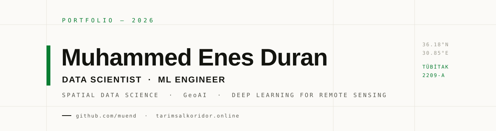
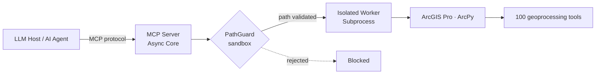

  

  
  
  
  

I build production-grade GeoAI and applied simulation systems: spatial decision-support tools, ArcGIS automation exposed to LLM agents, deep-learning pipelines for satellite imagery, and browser-based strategy simulations that turn complex real-world rules into usable products.

  
  
  
  
  

---

## Technical Core & Methodology

I focus on structural data science, spatial machine learning, and applied product systems. My work connects rigorous mathematical models with interfaces people can actually use: from GIS automation layers and satellite-imagery pipelines to static, browser-native decision-support and simulation products.

**Core AI / ML**
 

**Spatial Data Science**
 

-2C7FB8?style=flat-square&logo=arcgis&logoColor=white)

**Systems, MLOps & Product Engineering**
 

---

## Flagship Systems & Product Work

### 1. [arcgis-mcp-bridge](https://github.com/muend/arcgis-mcp-bridge)

An institutional-grade Model Context Protocol (MCP) framework exposing exactly **100 specialized geoprocessing tools** directly to LLM hosts and intelligent agents — turning ArcGIS Pro into a programmable backend for AI workflows.

- **Process Isolation:** Strictly decoupled multi-process architecture: async server core and isolated ArcPy worker subprocess.
- **Security Layer:** PathGuard sandbox with prefix validation over filesystem and geodatabase paths before algorithmic execution.
- **Agentic GIS:** Designed for local, controlled ArcGIS Pro automation from LLM hosts without collapsing the LLM runtime into the licensed GIS interpreter.

```mermaid
flowchart LR
    A["LLM Host / AI Agent"] -->|MCP protocol| B["MCP Server<br/>Async Core"]
    B --> C{"PathGuard<br/>sandbox"}
    C -->|path validated| D["Isolated Worker<br/>Subprocess"]
    C -.->|rejected| X["Blocked"]
    D --> E["ArcGIS Pro · ArcPy"]
    E --> F["100 geoprocessing tools"]
```

### 2. [agri-dss](https://github.com/muend/agri-dss) &nbsp;—&nbsp; Live at [tarimsalkoridor.online](https://tarimsalkoridor.online)

A fully client-side Spatial Decision Support System for the Western Antalya agricultural corridor — **5 districts, 147 neighborhoods** (Demre, Finike, Kaş, Kemer, Kumluca) — turning local agronomic and economic knowledge into a concrete, printable plan for each neighborhood.

- **Zero-Backend Static Architecture:** Vanilla JS application against a decoupled `data.json` layer — no backend, no build step, trivially hostable and auditable.
- **DRY Data Contract:** Compact `cropSets` / `longTermCrops` / `regions` schema resolved at runtime; recommendations can be updated by editing data only.
- **Swiss / Typographic Interface:** Guided stepper, corridor diagram, live counters, and clean A4 print output for village boards and cooperatives.

  

### 3. [FOUNDER.EXE](https://muend.itch.io/founderexe) &nbsp;—&nbsp; Browser Game / Startup Simulation

A browser-based startup simulation game modeling the practical stress of founding a company in **Türkiye or the USA**: taxes, incorporation choices, grants, investor expectations, cash flow, regulatory friction, AI-assisted advising, and bankruptcy/exit outcomes.

- **Rules-Driven Simulation:** Country-specific rule sets for Türkiye and the USA, including tax filings, company types, grants, regulatory constraints, inflation/currency pressure, investor interactions, and runway management.
- **Idea-Aware Onboarding:** The player writes a startup idea; the system analyzes sector, regulatory requirements, global potential, and market path before shaping the simulation.
- **Optional Live AI Layer:** Gemini, OpenAI, or Anthropic can be connected with the player's own API key; the game remains playable with scripted fallbacks when offline.
- **Static Web Product:** Runs in the browser, saves locally, and is published on itch.io as a free / pay-what-you-want release.

  

---

## Academic & Research Projects

Reproducible, peer-review–oriented studies in spatial econometrics, urban resilience, and deep learning for remote sensing.

### [agri-unet](https://github.com/muend/agri-unet) &nbsp;·&nbsp; `Deep Learning / CV` &nbsp;·&nbsp; 

The codebase for my **TÜBİTAK 2209-A** research project (*University Students Research Projects Support Program*) — an accepted, grant-funded study. A **U-Net** semantic segmentation pipeline for agricultural pattern identification from high-resolution, multi-temporal satellite imagery, extracting field parcels and crop structures for downstream suitability modeling.

### [turkiye-housing-prices-pandemic](https://github.com/muend/turkiye-housing-prices-pandemic) &nbsp;·&nbsp; `Spatial Econometrics`

Region-level analysis of Türkiye's housing market that separates real (inflation-adjusted) price growth from inflation, comparing the six years before and after the COVID-19 pandemic (2014–2025).

- Reproducible Python notebook with high-resolution choropleth figures and a House Price Index (HPI) deflation pipeline.
- **LISA** (Local Indicators of Spatial Association) analysis to detect statistically significant regional clusters and spatial outliers.

### [kutri-resilience-index](https://github.com/muend/kutri-resilience-index) &nbsp;·&nbsp; `Composite Indicators`

A reproducible urban-territorial resilience index prototype for Kaş / Bayındır, Antalya, based on a five-pillar composite indicator framework.

- Transparent indicator normalization and weighting methodology with fully reproducible notebooks and figures.
- Bridges quantitative spatial analysis with applied territorial planning.

---

## Featured Repositories

  
  

---

## Active Research & Product Workspace

- **Computer Vision for Remote Sensing:** Automated pipelines for agricultural pattern identification and urban object extraction from high-resolution multi-temporal satellite imagery using CNN and U-Net segmentation models.
- **Agentic GIS & MCP Tooling:** Secure local automation layers that expose GIS operations to LLM agents without compromising ArcGIS Pro runtime isolation.
- **Applied Simulation Systems:** Browser-native simulations that encode real-world regulatory, financial, and decision processes into interactive products.
- **Urban Resilience Forecasting:** Predictive spatial suitability matrices and long-term territorial resilience frameworks using robust statistical models.

---

## Focus

Open to collaborative tracks involving production-grade Data Science, Spatial Machine Learning pipelines, automated GeoAI systems architecture, and applied simulation products.

- **Portfolio:** [muend.github.io](https://muend.github.io)
- **Live App:** [tarimsalkoridor.online](https://tarimsalkoridor.online)
- **Game:** [FOUNDER.EXE on itch.io](https://muend.itch.io/founderexe)
- **Email:** [edcoders@gmail.com](mailto:edcoders@gmail.com)
