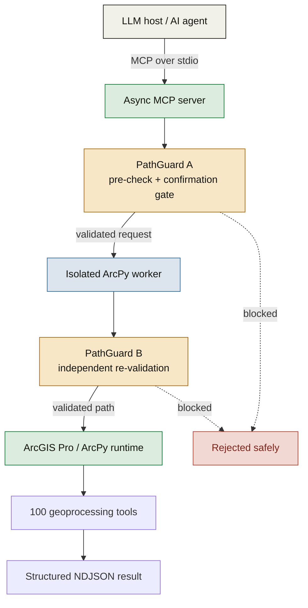

  

  
  
  
  
  
  

I build **GeoAI agent systems, geospatial AI infrastructure, remote-sensing data pipelines, spatial decision-support systems, and applied simulation products**.

My work sits between research-grade spatial analysis and usable software: standards-driven Agent Skills for reliable geospatial reasoning, ArcGIS Pro automation for LLM/MCP workflows, reproducible Sentinel-2 data pipelines, browser-native agricultural DSS tools, and realistic strategy simulations that encode real-world institutional rules into interactive systems.

  
  
  
  
  
  

---

## Shipping Now

| Project | Type | Status | Links |
|---|---|---:|---|
| **benchfck** | Deterministic evaluation generator / exact Rust harness | v0.4.0-alpha engineering candidate · no model results published | [GitHub](https://github.com/muend/benchfck) · [Validity contract](https://github.com/muend/benchfck/blob/main/VALIDITY.md) |
| **geoai-skills** | GeoAI agent system / Agent Skills suite | Active · 18 skills · benchmarked | [GitHub](https://github.com/muend/geoai-skills) · [Benchmark](https://github.com/muend/geoai-skills/blob/main/BENCHMARK.md) |
| **arcgis-mcp-bridge** | GeoAI infrastructure / MCP tooling | Active · PyPI · Glama A-rated | [GitHub](https://github.com/muend/arcgis-mcp-bridge) · [PyPI](https://pypi.org/project/arcgis-mcp-bridge/) |
| **sentinel-crop-pipeline** | Sentinel-2 data pipeline / research software | Active · PyPI · Zenodo DOI | [GitHub](https://github.com/muend/sentinel-crop-pipeline) · [PyPI](https://pypi.org/project/sentinel-crop-pipeline/) · [DOI](https://doi.org/10.5281/zenodo.21284444) |
| **agri-dss** | Spatial Decision Support System | Live | [Live app](https://tarimsalkoridor.online) · [GitHub](https://github.com/muend/agri-dss) |
| **FOUNDER.EXE** | Browser-based startup simulation | Published | [Play on itch.io](https://muend.itch.io/founderexe) |
| **kutri-resilience-index** | Composite indicator / spatial resilience research | Research prototype | [GitHub](https://github.com/muend/kutri-resilience-index) |

---

## Work Map

| Track | What I build | Representative work |
|---|---|---|
| **Deterministic Evaluation** | Exact generators, interpreters, restricted verifiers, validity contracts, and reproducible evidence packages | `benchfck` |
| **GeoAI Agent Systems** | Standards-driven skill suites that route geospatial tasks, encode methodological safeguards, and make spatial failure modes explicit | `geoai-skills` |
| **GeoAI Infrastructure** | Secure automation layers connecting GIS runtimes, LLM hosts, and geoprocessing workflows | `arcgis-mcp-bridge` |
| **Remote Sensing ML Pipelines** | Reproducible Sentinel-2 data preparation, patch generation, label masks, and downstream ML-ready datasets | `sentinel-crop-pipeline`, `agri-unet` |
| **Spatial Decision Systems** | Browser-native tools that turn spatial and agricultural knowledge into usable public-facing products | `agri-dss` |
| **Applied Simulation Products** | Rule-driven browser simulations for economic, regulatory, and strategic decision-making | `FOUNDER.EXE` |
| **Urban / Regional Analytics** | Spatial econometrics, resilience indices, and reproducible territorial analysis | `kutri-resilience-index`, `turkiye-housing-prices-pandemic` |

---

## Technical Core

**AI / ML / Data Science**  

**Spatial Data Science / Remote Sensing**  

-2C7FB8?style=flat-square&logo=arcgis&logoColor=white)

**Agent Systems / Evaluation**  

**Systems / Product Engineering**  

---

## Flagship Systems

### [benchfck](https://github.com/muend/benchfck)

A Brainfuck-based generator and exact Rust harness for producing, validating, and scoring controlled machine-state tasks across multiple instruction encodings.

- **Deterministic core:** exact execution, cross-encoding equivalence, restricted answer verification, and metric production without a learned judge.
- **Generated evaluation items:** programs and program-input items are produced from controlled constructors instead of shipping a fixed dataset.
- **Evidence discipline:** acceptance gates, manifests, preregistration, offline controls, and explicit boundaries between engineering evidence and future model evidence.
- **Current status:** `v0.4.0-alpha` engineering candidate; no model results or leaderboard are published.

---

### [geoai-skills](https://github.com/muend/geoai-skills)

An open, Agent Skills-compatible suite of **18 specialist and cross-cutting GeoAI skills** that turns general-purpose AI agents into more disciplined geospatial practitioners across data acquisition, remote sensing, spatial ML, statistics, optimization, databases, visualization, and guarded ArcGIS Pro execution.

- **Full-lifecycle orchestration:** a `geoai-orchestrator` routes multi-stage work across acquisition, sensing, modeling, analysis, and delivery skills.
- **Fail-loud spatial computing:** explicit CRS and unit checks, anti-leakage defaults, row-count accounting, visual + numeric verification, and uncertainty as a required deliverable.
- **Measured routing:** a frozen 120-case, 17-skill benchmark reports **100% routing precision, 92.86% recall, and 92.5% full-route accuracy** for the declared Claude Code / Claude Sonnet runtime pair; the results measure routing rather than answer quality and exclude the later ArcGIS skill.
- **Evaluation infrastructure:** typed scenarios, versioned JSON schemas, blind request preparation, deterministic scoring, reproducible evidence packages, and an independent-family Gemini judge adapter.
- **Portable distribution:** installable as a Claude Code plugin or as self-contained skills in any Agent Skills-compatible runtime.
- **Guarded proprietary execution:** the `arcgis-pro-automation` skill delegates real ArcPy work to `arcgis-mcp-bridge` with local runtime and mutation safeguards.

  
  
  

---

### [arcgis-mcp-bridge](https://github.com/muend/arcgis-mcp-bridge)

An MCP framework exposing **100 specialized ArcGIS Pro / ArcPy geoprocessing tools** to LLM hosts and intelligent agents while keeping the licensed GIS runtime isolated from the host process.

- **MCP-native GIS automation:** ArcGIS Pro geoprocessing exposed through Model Context Protocol.
- **Runtime isolation:** async MCP server separated from the ArcPy worker subprocess.
- **Path safety:** PathGuard validation layer before filesystem and geodatabase operations.
- **Distribution:** published on PyPI and listed on Glama with A-rated MCP quality.
- **Testing:** mocked ArcPy test strategy for development without requiring ArcGIS Pro in CI.

```mermaid
flowchart TB
    H["LLM host / AI agent"] -->|MCP over stdio| S["Async MCP server"]
    S --> A["PathGuard A<br/>pre-check + confirmation gate"]
    A -->|validated request| W["Isolated ArcPy worker"]
    W --> B["PathGuard B<br/>independent re-validation"]
    B -->|validated path| G["ArcGIS Pro / ArcPy runtime"]
    G --> T["100 geoprocessing tools"]
    T --> O["Structured NDJSON result"]
    A -.->|blocked| X["Rejected safely"]
    B -.->|blocked| X

    style H fill:#F1F1EA,stroke:#13140F,color:#13140F
    style S fill:#DCECDF,stroke:#0A7D32,color:#13140F
    style A fill:#F7E7C7,stroke:#A9650E,color:#13140F
    style W fill:#DCE5EE,stroke:#2C67A0,color:#13140F
    style B fill:#F7E7C7,stroke:#A9650E,color:#13140F
    style G fill:#DCECDF,stroke:#0A7D32,color:#13140F
    style X fill:#F1D8D3,stroke:#B83C2C,color:#7C261B
```

---

### [sentinel-crop-pipeline](https://github.com/muend/sentinel-crop-pipeline)

A reproducible **Sentinel-2 data preparation pipeline** for crop-classification research. It prepares training-ready geospatial datasets for downstream CNN/U-Net or other remote-sensing ML models.

- **CDSE-first workflow:** Sentinel-2 L2A scene discovery and AOI-cropped download through Copernicus Data Space Ecosystem.
- **Cloud-aware preprocessing:** metadata cloud filtering, SCL invalid-pixel checks, cloud/shadow/snow masking, reflectance normalization, and spectral indices.
- **Training-ready patches:** COG/TIFF patches for QGIS inspection plus NPY/TFRecord exports for model training.
- **Spatially blocked splits:** train/validation/test assignment by spatial blocks to reduce leakage from neighbouring patches.
- **Ground truth:** GeoJSON/Shapefile crop polygons rasterized into patch-aligned `uint8` masks.
- **Research artifact:** PyPI package, Zenodo DOI, CI, examples, validation run, and citation metadata.

  
  

---

### [agri-dss](https://github.com/muend/agri-dss) — live at [tarimsalkoridor.online](https://tarimsalkoridor.online)

A fully client-side Spatial Decision Support System for the Western Antalya agricultural corridor: **5 districts, 147 neighborhoods** across Demre, Finike, Kaş, Kemer, and Kumluca.

- **Zero-backend static architecture:** Vanilla JS over a decoupled `data.json` layer.
- **Auditable recommendation logic:** compact crop and region schema resolved at runtime.
- **Field-facing output:** guided interface and clean A4 print plans for local agricultural planning.
- **Deployment:** static, easily hosted, and low-maintenance.

---

### [FOUNDER.EXE](https://muend.itch.io/founderexe)

A browser-based startup simulation game modeling the practical stress of founding a company in **Türkiye or the USA**: taxes, incorporation choices, grants, investor expectations, cash flow, regulatory friction, and failure/exit outcomes.

- **Rules-driven simulation:** country-specific startup, tax, grant, regulatory, and runway logic.
- **Idea-aware onboarding:** the player writes a startup idea; the system shapes the simulation around sector and market assumptions.
- **Optional AI layer:** Gemini, OpenAI, or Anthropic can be connected with the player's own API key; scripted fallbacks keep the game playable offline.
- **Browser-native product:** static web app with local save persistence.

  

---

## Research Projects

### [agri-unet](https://github.com/muend/agri-unet) · `Deep Learning / Remote Sensing`

Downstream model-training work for agricultural pattern identification from satellite imagery. This track is separated from `sentinel-crop-pipeline`, which focuses only on reproducible data preparation.

### [turkiye-housing-prices-pandemic](https://github.com/muend/turkiye-housing-prices-pandemic) · `Spatial Econometrics`

A reproducible regional analysis of Türkiye's housing market before and after the COVID-19 pandemic, separating nominal changes from inflation-adjusted real price growth and using spatial statistics to detect regional clusters.

- HPI deflation workflow.
- Choropleth and comparative regional figures.
- LISA-style spatial cluster and outlier interpretation.

### [kutri-resilience-index](https://github.com/muend/kutri-resilience-index) · `Composite Indicators / Urban Resilience`

A reproducible urban-territorial resilience index prototype for Kaş / Bayındır, Antalya.

- Five-pillar composite indicator framework.
- Transparent normalization and weighting.
- Reproducible notebooks, figures, and methodology.

### [Studyo Rehberi](https://github.com/muend/studyo_rehberi) · `Planning Education / Accessible Web`

A browser-native planning and zoning study atlas focused on Kaş and Antalya, covering planning theory, legislation, urban analysis, and accessible static delivery.

---

## Repository Map

| Repository / Product | Best entry point | Why it matters |
|---|---|---|
| [`benchfck`](https://github.com/muend/benchfck) | Deterministic evaluation | Exact Rust generator and harness for controlled machine-state tasks with explicit validity and evidence boundaries |
| [`geoai-skills`](https://github.com/muend/geoai-skills) | GeoAI agent system | 18 standards-driven Agent Skills spanning the geospatial lifecycle with explicit safeguards and reproducible routing evaluation |
| [`arcgis-mcp-bridge`](https://github.com/muend/arcgis-mcp-bridge) | GeoAI infrastructure | ArcGIS Pro automation for LLM/MCP workflows with runtime isolation and path safety |
| [`sentinel-crop-pipeline`](https://github.com/muend/sentinel-crop-pipeline) | Remote sensing data pipeline | Reproducible Sentinel-2 data preparation for downstream crop-classification models |
| [`agri-dss`](https://github.com/muend/agri-dss) | Product / DSS | Live, zero-backend spatial decision-support system for agricultural planning |
| [`agri-unet`](https://github.com/muend/agri-unet) | Deep learning research | Downstream remote-sensing model training for agricultural pattern identification |
| [`kutri-resilience-index`](https://github.com/muend/kutri-resilience-index) | Composite indicators | Reproducible urban-territorial resilience index methodology |
| [`turkiye-housing-prices-pandemic`](https://github.com/muend/turkiye-housing-prices-pandemic) | Spatial econometrics | Housing-price analysis with inflation adjustment and spatial clustering |
| [`studyo_rehberi`](https://github.com/muend/studyo_rehberi) | Planning education | Accessible browser-native study atlas for planning, zoning legislation, and urban analysis |
| [FOUNDER.EXE](https://muend.itch.io/founderexe) | Applied simulation product | Browser game modeling startup formation, taxes, funding, and regulatory friction |

---

## Live Metrics

  
  
  
  
  
  
  
  
  

<!-- Suggested GitHub profile pins:
benchfck,
geoai-skills,
arcgis-mcp-bridge,
sentinel-crop-pipeline,
agri-dss,
kutri-resilience-index.
-->

---

## Product Notes / Case-Study Hooks

These are the narratives I am expanding into separate portfolio case studies:

- **benchfck:** separating deterministic engineering evidence from future model evidence through exact execution, restricted verification, manifests, and preregistered release gates.
- **geoai-skills:** turning tacit geospatial practice into portable agent instructions, then measuring whether specialist skills route correctly without overstating behavior quality.
- **arcgis-mcp-bridge:** separating licensed GIS execution from AI host runtimes while preserving secure, discoverable geoprocessing access.
- **sentinel-crop-pipeline:** making Sentinel-2 crop-classification data preparation reproducible before the model-training stage.
- **agri-dss:** compressing agricultural suitability and local economic knowledge into printable, village-level decision plans.
- **FOUNDER.EXE:** encoding company formation, tax pressure, grants, investment logic, regulatory constraints, and optional AI advising into a playable browser simulation.

---

## Current Focus

- **Deterministic Evaluation Systems:** exact benchmark generation, restricted verification, controlled encodings, validity contracts, and evidence boundaries.
- **GeoAI Agent Systems:** portable Agent Skills, routing evaluation, spatial-method safeguards, and reproducible evidence for agent behavior.
- **Agentic GIS & MCP Tooling:** secure local automation layers that expose GIS operations to LLM agents without compromising ArcGIS Pro runtime isolation.
- **Remote Sensing ML Pipelines:** reproducible Sentinel-2 workflows, ground-truth masks, spatially blocked splits, and downstream segmentation experiments.
- **Spatial Decision Support:** static, auditable, browser-native systems for agricultural and territorial planning.
- **Applied Simulation Systems:** strategy simulations that encode real-world regulatory, economic, and decision processes into interactive products.
- **Urban & Regional Analytics:** composite indices, spatial econometrics, and territorial resilience frameworks.

---

## Contact

Open to collaboration around **deterministic evaluation systems**, production-grade **GeoAI agent systems**, **spatial machine learning**, **remote-sensing data pipelines**, **MCP infrastructure**, and **applied simulation products**.

- **Portfolio:** [muend.github.io](https://muend.github.io)
- **Live App:** [tarimsalkoridor.online](https://tarimsalkoridor.online)
- **Game:** [FOUNDER.EXE on itch.io](https://muend.itch.io/founderexe)
- **Email:** [edcoders@gmail.com](mailto:edcoders@gmail.com)

